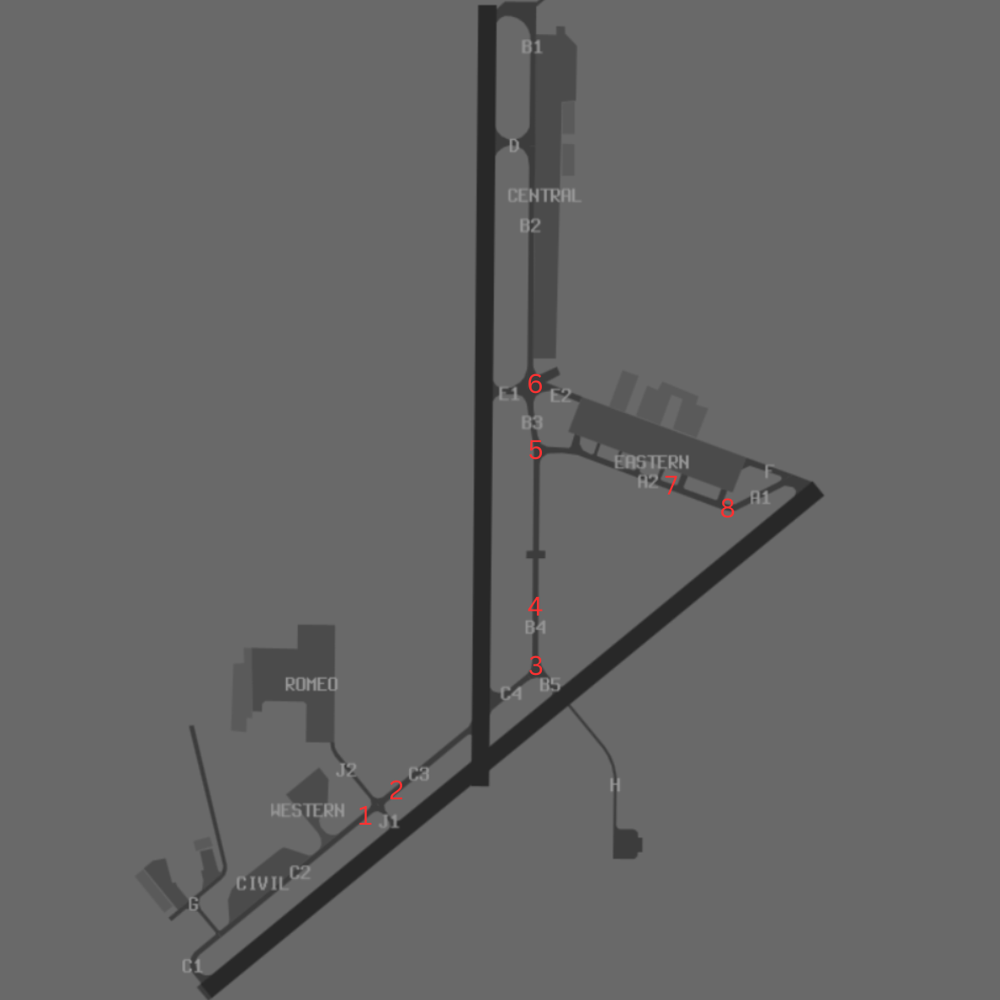

--8<-- "includes/abbreviations.md"

## Positions

| Name               | ID      | Callsign       | Frequency        | Login Identifier              |
| ------------------ | --------------| -------------- | ---------------- | --------------------------------------|
| Nowra ADC    | | Nowra Tower  | 118.850         | NW_TWR        |
| Nowra SMC   ||  Nowra Ground  | 135.850         | NW_GND        |
| Nowra ACD    | | Nowra Delivery  | 128.350         | NW_DEL       |
| Nowra ATIS    |   | | 125.65         | YSNW_ATIS       |

## Airspace
NWA ADC owns the Class C airspace from `SFC` to `A015`, 5nm from the NW TACAN. This airspace is designed to facilitate Helicopter Traffic and Ciruit Traffic.

## Aerodrome

### General Guidelines

1. **Ground Taxiing for Wheeled Helicopters**
    - Where practicable, wheeled helicopters are encouraged to “ground taxi” on prepared surfaces to minimize rotor wash and its effects.

### The Runway Mode options available are:

a) Runway 21 and Runway 08;  
b) Runway 21 and Runway 26;  
c) Runway 21 only;  
d) Runway 03 and Runway 08;  
e) Runway 03 and Runway 26;   

## Charts
!!! note
    Additional charts to the AIP may be found in the RAAF TERMA document, available towards the bottom of [RAAF AIP page](https://ais-af.airforce.gov.au/australian-aip){target=new}

## Miscellaneous
### Circuit Procedures
Circuit operations at Nowra occur within the CIRA, a `5NM` radius of Nowra, from the surface to `A020`.

- Fixed wing: `A020`
- Rotary wing: `A012`
- Flight Deck Procedural Trainer: not above `A007`

### Circuit Direction
| Runway | Direction |
| ------ | ----------|
| 08     | Right  |
| 21     | Right |
| 03     | Left |
| 26     | Left |

## Helicopter Operations

### Helicopter Spots

The following helicopter spots are designated on various taxiways at Nowra aerodrome to facilitate visual helicopter arrivals and departures day and night.

IFR traffic must depart from the active duty runway.

These spots are physically marked with bidirectional numbers in addition to the standard “H” marking:

* Spot-1 (Taxiway C2)
* Spot-2 (Taxiway C3)
* Spot-3 (Taxiway B4)
* Spot-4 (Taxiway B4)
* Spot-5 (Taxiway B3)
* Spot-6 (Taxiway B3)
* Spot-7 (Taxiway A2)
* Spot-8 (Taxiway A2)

<figure markdown>
{ width="700" }
<figcaption>NW VFR CRD</figcaption>
</figure>

Helicopter departures for aircraft not requiring the use of a runway shall be conducted from the helicopter spots.  Helicopter spots shall be used by all departures and arrivals. Helicopters must remain at their designated slot until given a clearance from GND or TWR.

Take-offs and landings to the Helicopter Spots should be parallel to the duty RWY direction. Normally the most upwind Helicopter Spot parallel to the RWY is designated for departures, and the downwind Helicopter Spot designated for arrivals. Helicopter Spots have been designed to allow simultaneous arrivals and departures of an adjacent Helicopter Spot.

Post landing at a Helicopter Spot, helicopters shall not vacate the Spot until in receipt of a taxi clearance from ATC (SMC)

### Duty runway Spots
| Active Runway | Departure Spots (Order of Preference) | Arrival Spots (Order of Preference) |
|---------------|----------------------------------------|-------------------------------------|
| Runway 08     | Spot-2 (C3), Spot-1 (C2)               | Spot-8 (A2), Spot-7 (A2)            |
| Runway 26     | Spot-8 (A2), Spot-7 (A2)               | Spot-2 (C3), Spot-1 (C2)            |
| Runway 03     | Spot-6 (B3), Spot-5 (B3)               | Spot-4 (B4), Spot-3 (B4)            |
| Runway 21     | Spot-4 (B4), Spot-3 (B4)               | Spot-6 (B3), Spot-5 (B3)            |

## Coordination
NWA TCU

'Next' coordination is required from NWA ADC to NWA TCU for all aircraft.

Helicopter departing from helicopter spots will be treated as if departing from that duty runway.

!!! example
    **NWA ADC** -> **NWA TCU**: "Next, ASY01, runway 08"  
    **NWA TCU** -> **NWA ADC**: "ASY01, Assigned Heading Left 030, unrestricted"  
    **NWA ADC** -> **NWA TCU**: "Assigned Heading Heading Left 030, ASY01" 

### Level Assignment
The Standard Assignable Level from **NWA ADC** to **NWA TCU** is:

Issue `F130` or `RFL`; whichever is lower, to aircraft cleared via an SID or aircraft with a wake turbulence category of medium or greater.  
Issue `F130` or `RFL`; whichever is lower, to jet aircraft not cleared via an SID regardless of wake turbulence category.  
Issue `A030` or `RFL`; whichever is lower, to aircraft not cleared via an SID with a wake turbulence category of light.  
Issue `A025` or `RFL`; whichever is lower, to VFR traffic.
